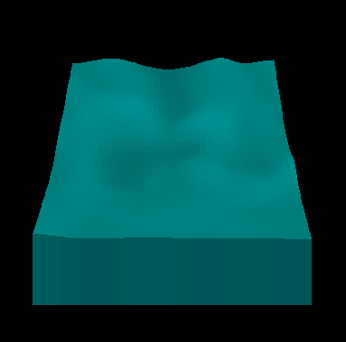

# WaterSimulator
 
This is a water simulation I wrote many years ago. The surface is represented by a grid, where each grid point has a different height. You can click on the water to disturb it, and you'll see ripple effects in real time.

